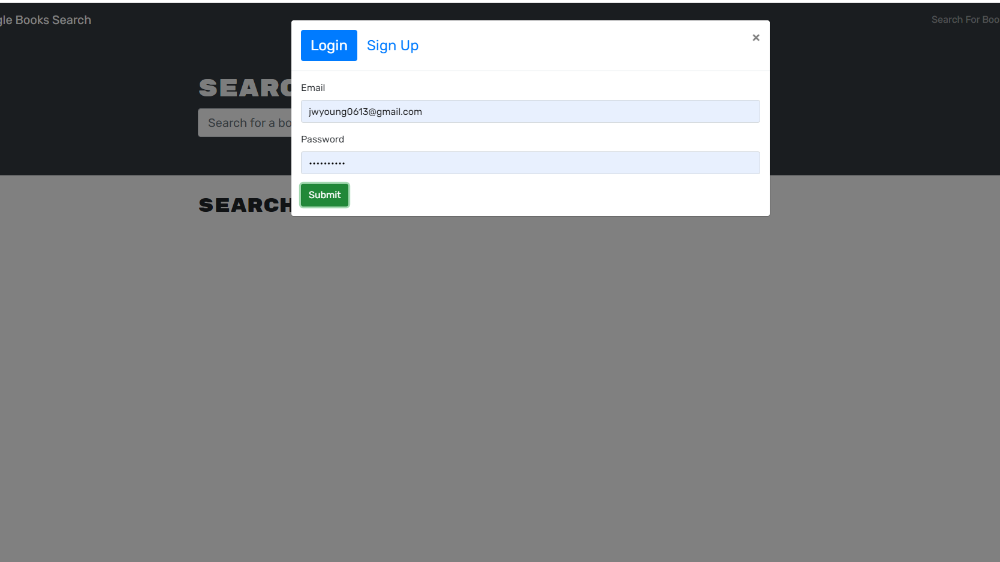
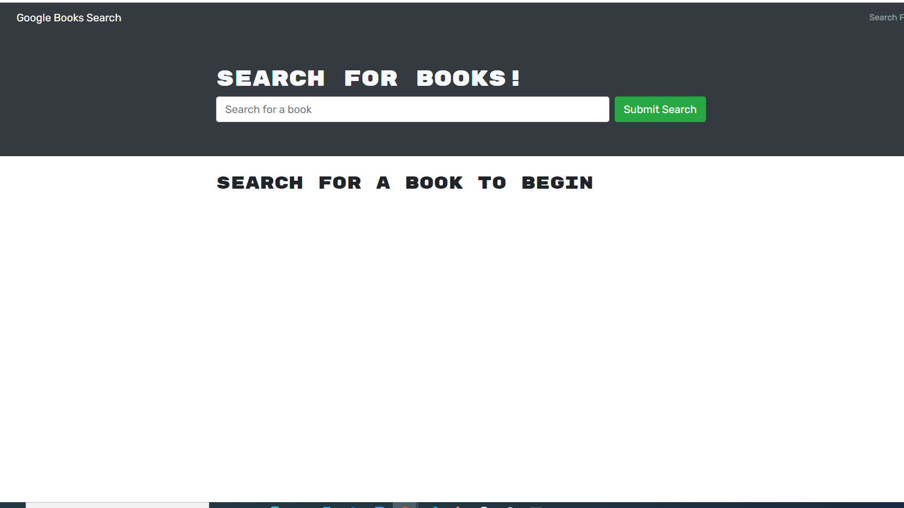
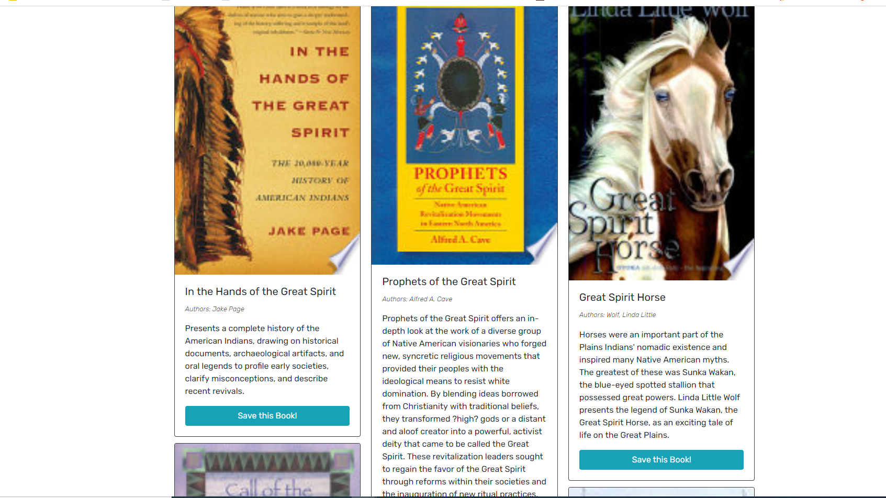
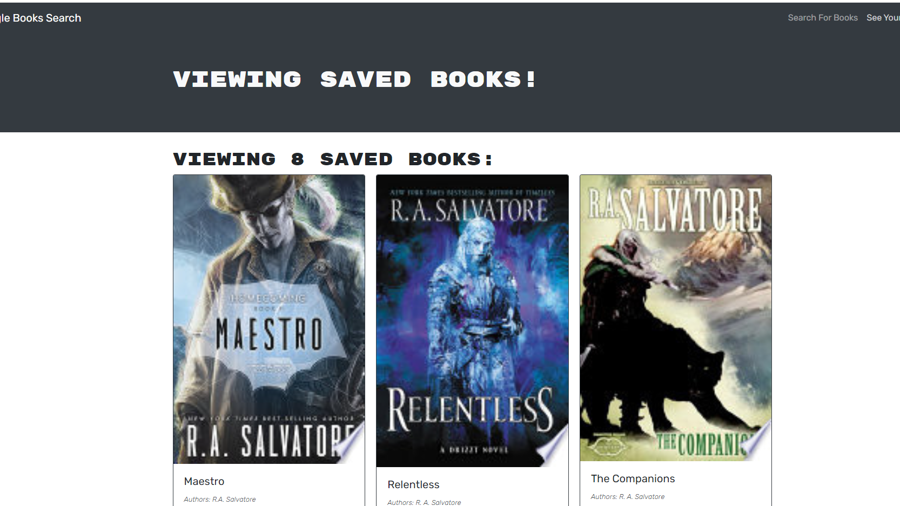
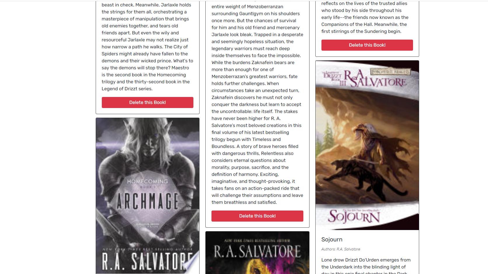

# Book Search Engine Starter Code

## Description

Book Search engine with restructured code to make a React app using the full MERN stack

## Technologies Used

- Heroku
- JavaScript
- Mongo
- [MongoDB Atlas] (<https://www.mongodb.com/cloud/atlas>)
- Mongoose
- MERN Stack
- GraphQL

## Deployed App

[This Book-Search app has been deployed on Heroku and is available here.](https://gentle-wave-36556.herokuapp.com/)

SCREENSHOTS: Login, Home, Save, Saved, & Delete.

## License

  This project is licensed under the terms of the following license: **MIT**.

## Questions

  GitHub: [jyoung0613](https://github.com/jyoung0613).  
